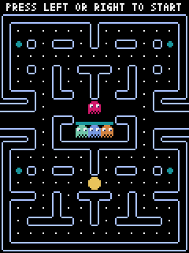
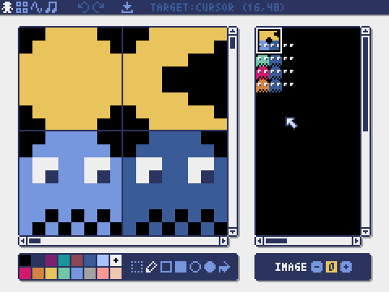
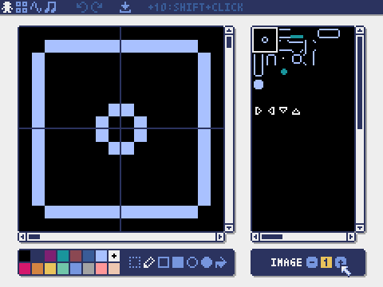
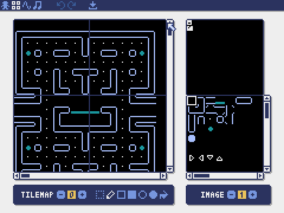
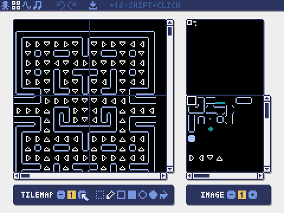

# Pac-Man style game in Python using Pyxel

## [Click to play in browser with gamepad overlay for mobile](https://kitao.github.io/pyxel/wasm/launcher/?play=4-3is4-me.pyxel-pac-man.build.pyxel-pac-man&gamepad=enabled)

## [Click to play in browser without gamepad overlay](https://kitao.github.io/pyxel/wasm/launcher/?play=4-3is4-me.pyxel-pac-man.build.pyxel-pac-man)

#### Toggle fullscreen  - Alt + Enter
#### Switch style - Alt + 9

#### I created this Pac-Man game as a quick and simple way to learn Pyxel and the Pyxel editor. To reduce development time, sprites and tilemap tiles are based on 8x8 pixel blocks and there is no sound, which might be a good thing!

Image bank 0 

Image bank 1 

Tilemap bank 0 

Tilemap bank 1 

